# Diagramas UML de los patrones

Los diagramas muestran las clases que colaboran en cada capacidad, sus dependencias y las relaciones de composición o herencia. Los detalles de transporte y persistencia aparecen cuando intervienen en el patrón. [Decisiones y límites](SOLUCION_PATRONES.md)

## DP-01 Factory Method

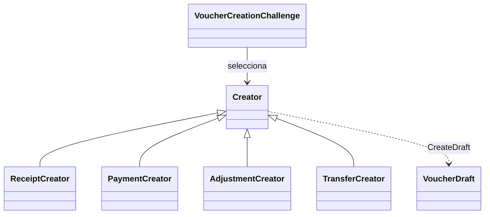
```mermaid
classDiagram
    VoucherCreationChallenge --> Creator : selecciona
    Creator <|-- ReceiptCreator
    Creator <|-- PaymentCreator
    Creator <|-- AdjustmentCreator
    Creator <|-- TransferCreator
    Creator ..> VoucherDraft : CreateDraft
```

## DP-02 Abstract Factory

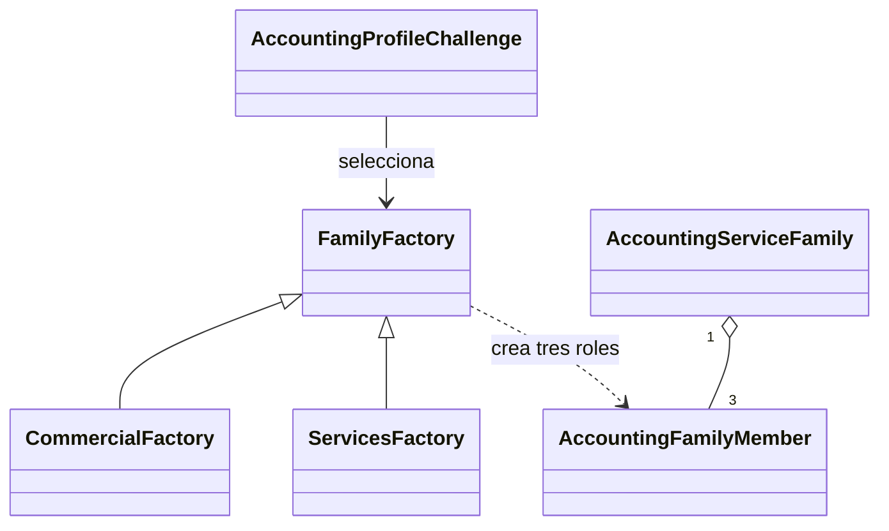
```mermaid
classDiagram
    AccountingProfileChallenge --> FamilyFactory : selecciona
    FamilyFactory <|-- CommercialFactory
    FamilyFactory <|-- ServicesFactory
    FamilyFactory ..> AccountingFamilyMember : crea tres roles
    AccountingServiceFamily "1" o-- "3" AccountingFamilyMember
```

## DP-03 Builder

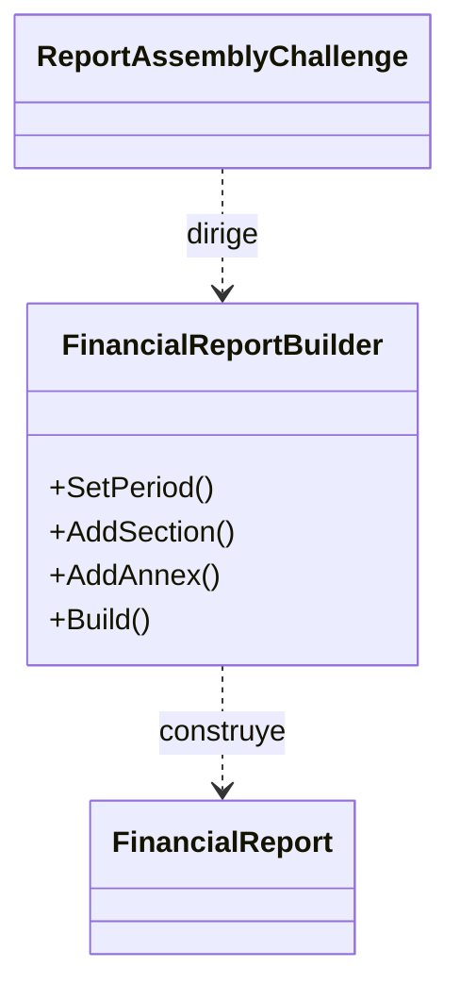
```mermaid
classDiagram
    ReportAssemblyChallenge ..> FinancialReportBuilder : dirige
    FinancialReportBuilder : +SetPeriod()
    FinancialReportBuilder : +AddSection()
    FinancialReportBuilder : +AddAnnex()
    FinancialReportBuilder : +Build()
    FinancialReportBuilder ..> FinancialReport : construye
```

## DP-04 Prototype

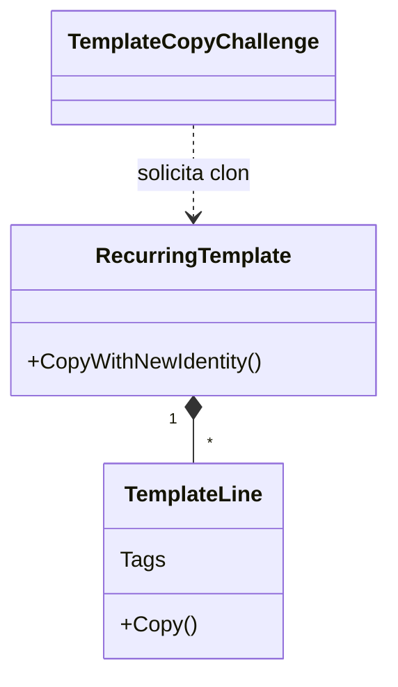
```mermaid
classDiagram
    TemplateCopyChallenge ..> RecurringTemplate : solicita clon
    RecurringTemplate : +CopyWithNewIdentity()
    RecurringTemplate "1" *-- "*" TemplateLine
    TemplateLine : +Copy()
    TemplateLine : Tags
```

## DP-05 Singleton

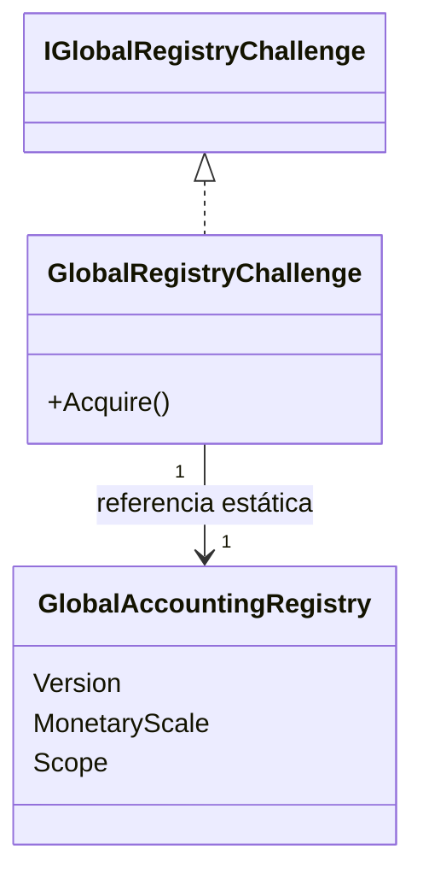
```mermaid
classDiagram
    IGlobalRegistryChallenge <|.. GlobalRegistryChallenge
    GlobalRegistryChallenge "1" --> "1" GlobalAccountingRegistry : referencia estática
    GlobalRegistryChallenge : +Acquire()
    GlobalAccountingRegistry : Version
    GlobalAccountingRegistry : MonetaryScale
    GlobalAccountingRegistry : Scope
```

## DP-06 Adapter

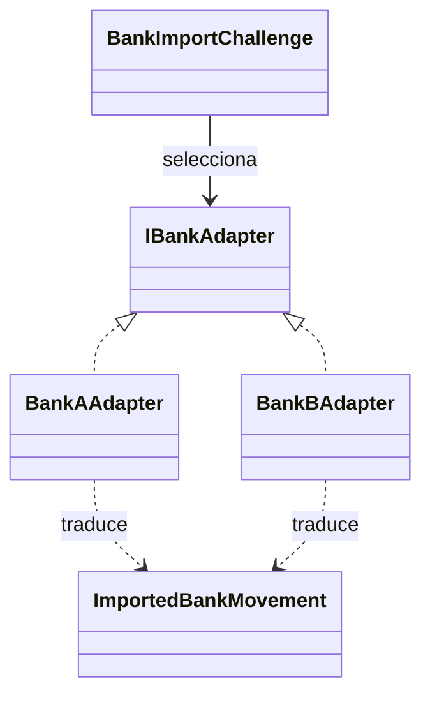
```mermaid
classDiagram
    BankImportChallenge --> IBankAdapter : selecciona
    IBankAdapter <|.. BankAAdapter
    IBankAdapter <|.. BankBAdapter
    BankAAdapter ..> ImportedBankMovement : traduce
    BankBAdapter ..> ImportedBankMovement : traduce
```

## DP-07 Bridge

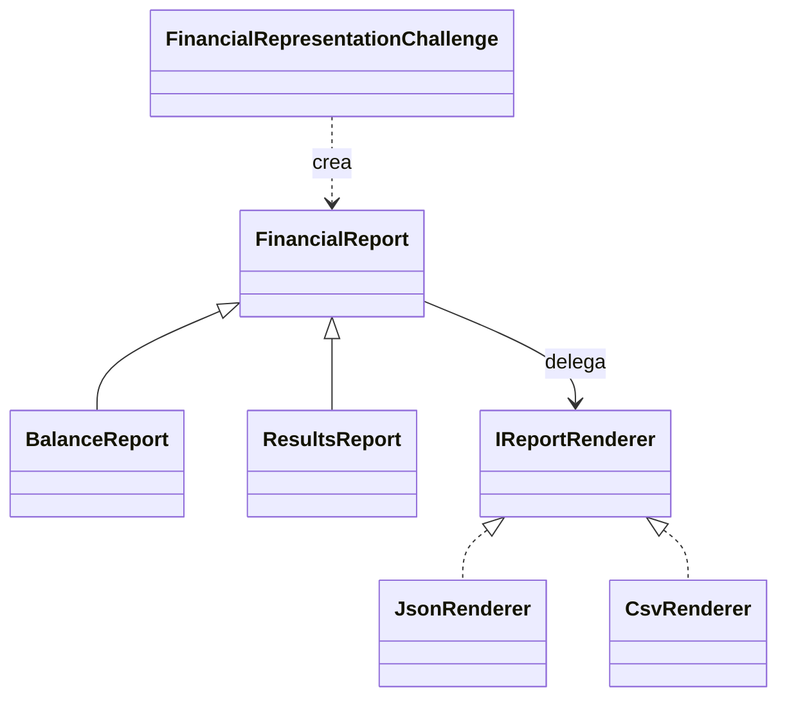
```mermaid
classDiagram
    FinancialRepresentationChallenge ..> FinancialReport : crea
    FinancialReport <|-- BalanceReport
    FinancialReport <|-- ResultsReport
    FinancialReport --> IReportRenderer : delega
    IReportRenderer <|.. JsonRenderer
    IReportRenderer <|.. CsvRenderer
```

## DP-08 Composite

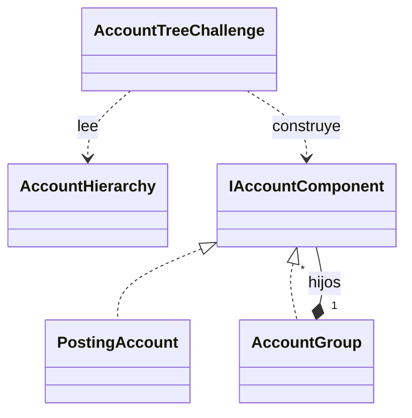
```mermaid
classDiagram
    AccountTreeChallenge ..> AccountHierarchy : lee
    AccountTreeChallenge ..> IAccountComponent : construye
    IAccountComponent <|.. PostingAccount
    IAccountComponent <|.. AccountGroup
    AccountGroup "1" *-- "*" IAccountComponent : hijos
```

## DP-09 Decorator

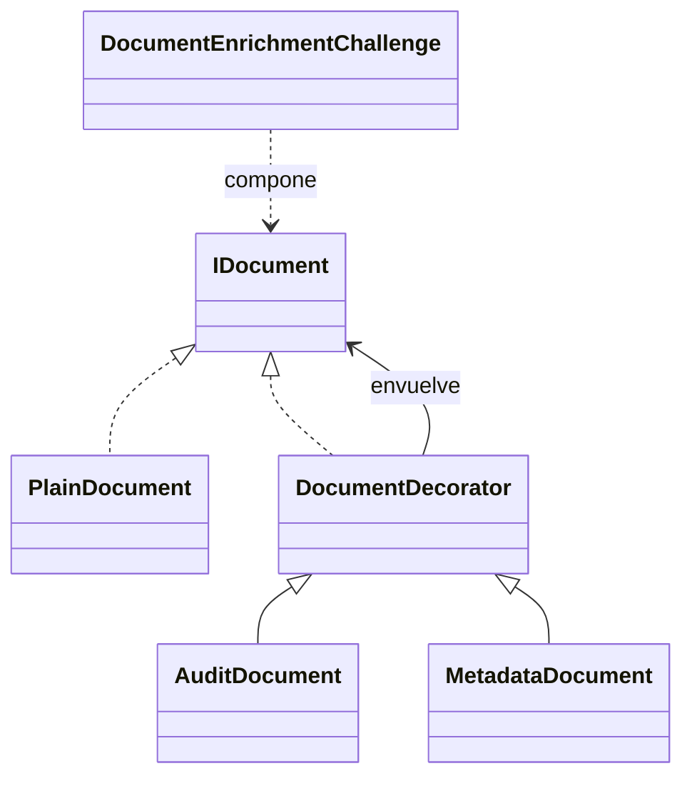
```mermaid
classDiagram
    DocumentEnrichmentChallenge ..> IDocument : compone
    IDocument <|.. PlainDocument
    IDocument <|.. DocumentDecorator
    DocumentDecorator --> IDocument : envuelve
    DocumentDecorator <|-- AuditDocument
    DocumentDecorator <|-- MetadataDocument
```

## DP-10 Facade

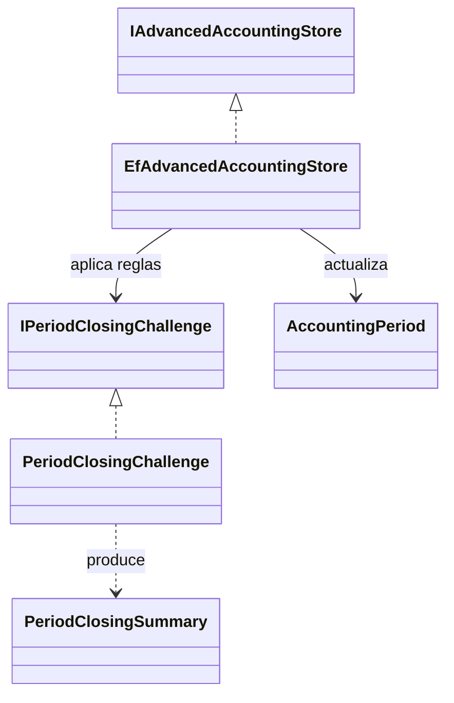
```mermaid
classDiagram
    IAdvancedAccountingStore <|.. EfAdvancedAccountingStore
    EfAdvancedAccountingStore --> IPeriodClosingChallenge : aplica reglas
    IPeriodClosingChallenge <|.. PeriodClosingChallenge
    PeriodClosingChallenge ..> PeriodClosingSummary : produce
    EfAdvancedAccountingStore --> AccountingPeriod : actualiza
```

## DP-11 Flyweight

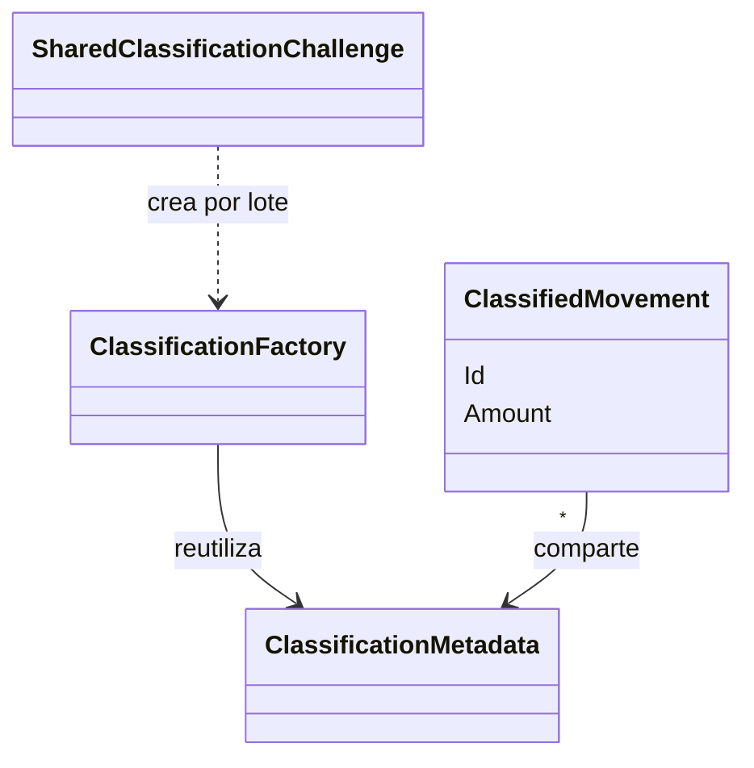
```mermaid
classDiagram
    SharedClassificationChallenge ..> ClassificationFactory : crea por lote
    ClassificationFactory --> ClassificationMetadata : reutiliza
    ClassifiedMovement "*" --> "1" ClassificationMetadata : comparte
    ClassifiedMovement : Id
    ClassifiedMovement : Amount
```

## DP-12 Proxy

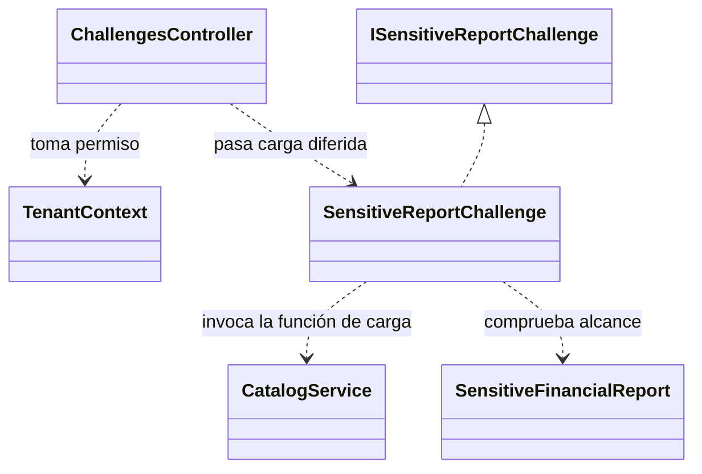
```mermaid
classDiagram
    ChallengesController ..> TenantContext : toma permiso
    ChallengesController ..> SensitiveReportChallenge : pasa carga diferida
    ISensitiveReportChallenge <|.. SensitiveReportChallenge
    SensitiveReportChallenge ..> CatalogService : invoca la función de carga
    SensitiveReportChallenge ..> SensitiveFinancialReport : comprueba alcance
```

## DP-13 Chain of Responsibility

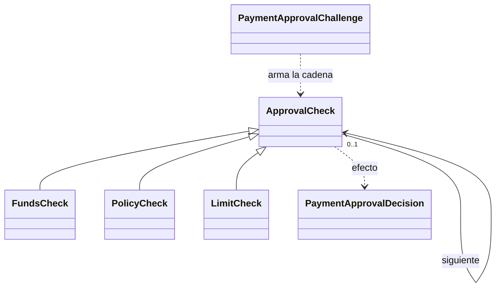
```mermaid
classDiagram
    PaymentApprovalChallenge ..> ApprovalCheck : arma la cadena
    ApprovalCheck --> "0..1" ApprovalCheck : siguiente
    ApprovalCheck <|-- FundsCheck
    ApprovalCheck <|-- PolicyCheck
    ApprovalCheck <|-- LimitCheck
    ApprovalCheck ..> PaymentApprovalDecision : efecto
```

## DP-14 Command

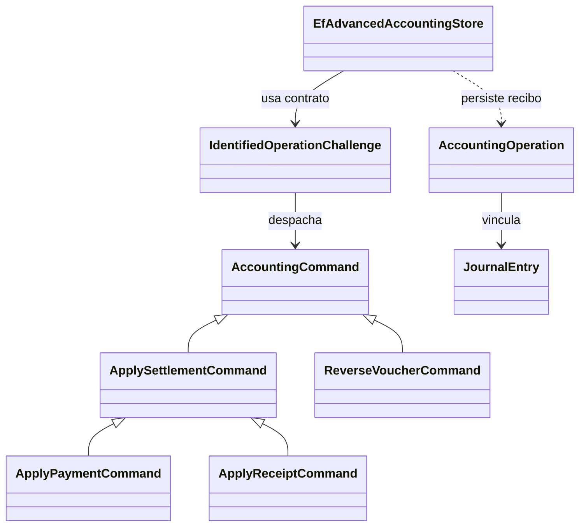
```mermaid
classDiagram
    IdentifiedOperationChallenge --> AccountingCommand : despacha
    AccountingCommand <|-- ApplySettlementCommand
    ApplySettlementCommand <|-- ApplyPaymentCommand
    ApplySettlementCommand <|-- ApplyReceiptCommand
    AccountingCommand <|-- ReverseVoucherCommand
    EfAdvancedAccountingStore --> IdentifiedOperationChallenge : usa contrato
    EfAdvancedAccountingStore ..> AccountingOperation : persiste recibo
    AccountingOperation --> JournalEntry : vincula
```

## DP-15 Iterator

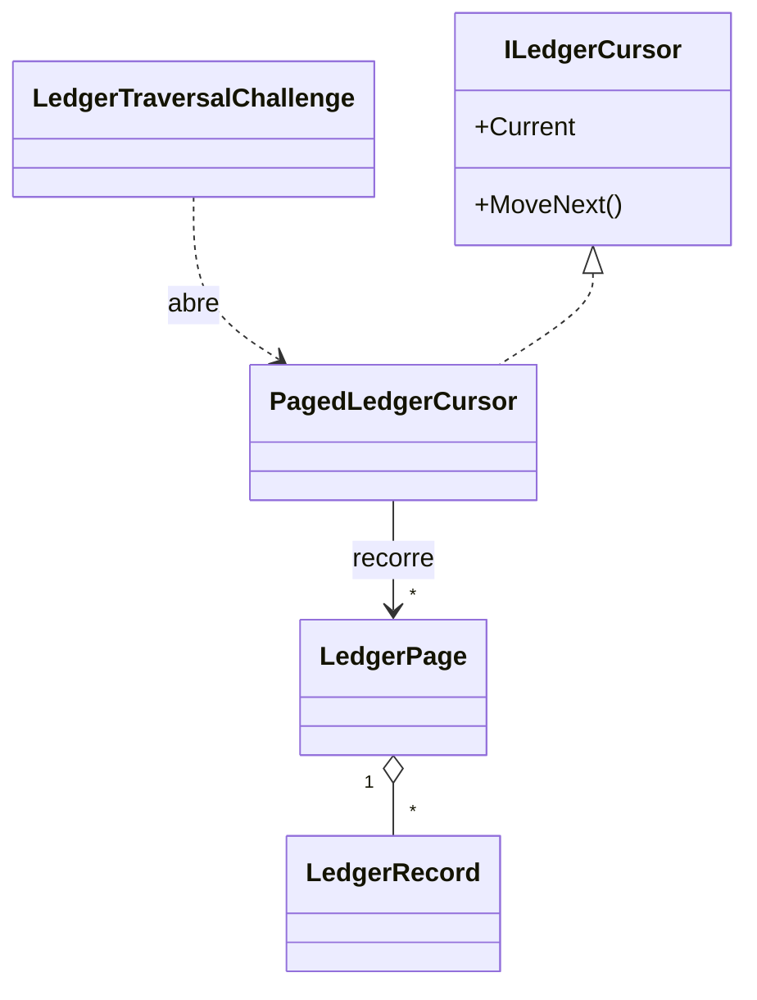
```mermaid
classDiagram
    LedgerTraversalChallenge ..> PagedLedgerCursor : abre
    ILedgerCursor <|.. PagedLedgerCursor
    PagedLedgerCursor --> "*" LedgerPage : recorre
    LedgerPage "1" o-- "*" LedgerRecord
    ILedgerCursor : +MoveNext()
    ILedgerCursor : +Current
```

## DP-16 Mediator

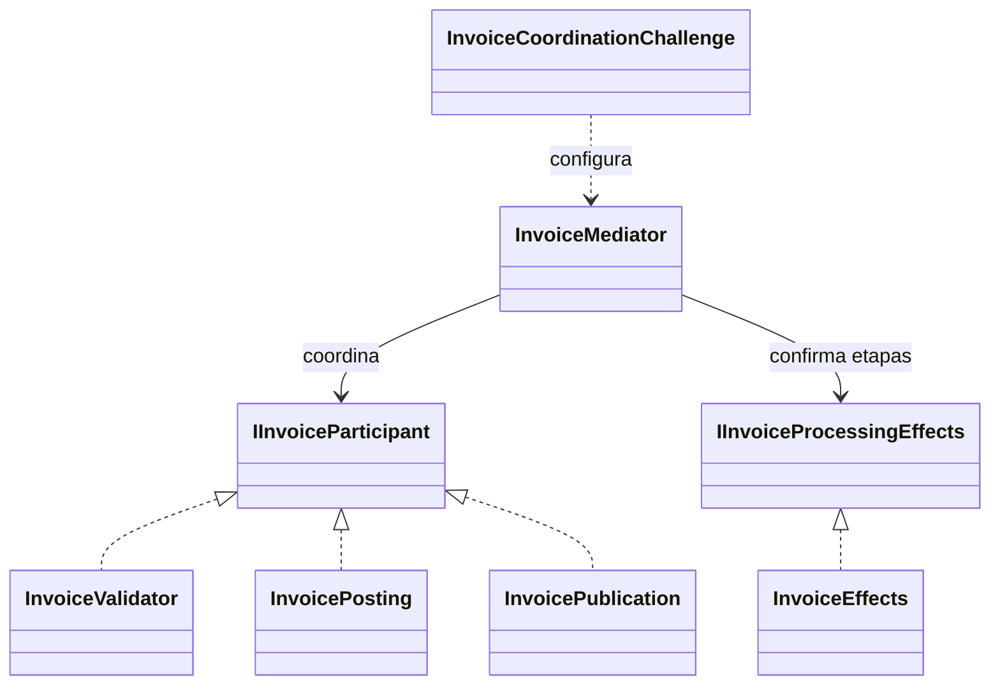
```mermaid
classDiagram
    InvoiceCoordinationChallenge ..> InvoiceMediator : configura
    InvoiceMediator --> IInvoiceParticipant : coordina
    IInvoiceParticipant <|.. InvoiceValidator
    IInvoiceParticipant <|.. InvoicePosting
    IInvoiceParticipant <|.. InvoicePublication
    InvoiceMediator --> IInvoiceProcessingEffects : confirma etapas
    IInvoiceProcessingEffects <|.. InvoiceEffects
```

## DP-17 Memento

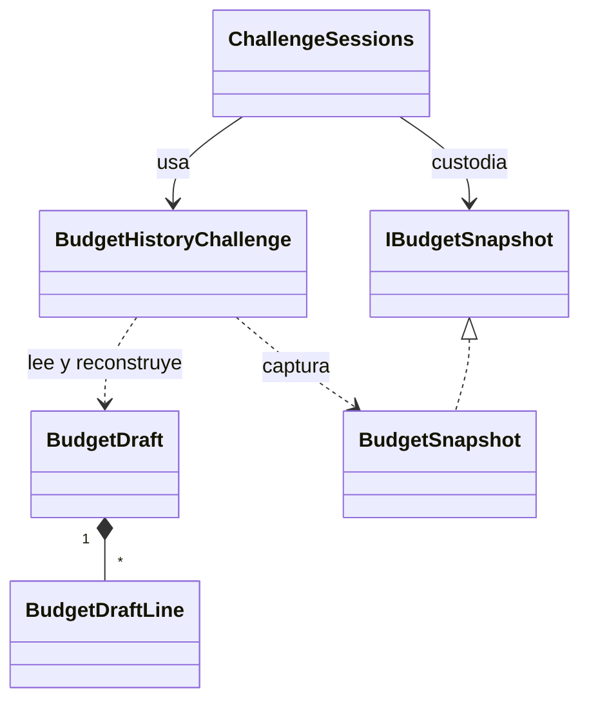
```mermaid
classDiagram
    ChallengeSessions --> BudgetHistoryChallenge : usa
    BudgetHistoryChallenge ..> BudgetDraft : lee y reconstruye
    BudgetHistoryChallenge ..> BudgetSnapshot : captura
    IBudgetSnapshot <|.. BudgetSnapshot
    ChallengeSessions --> IBudgetSnapshot : custodia
    BudgetDraft "1" *-- "*" BudgetDraftLine
```

## DP-18 Observer

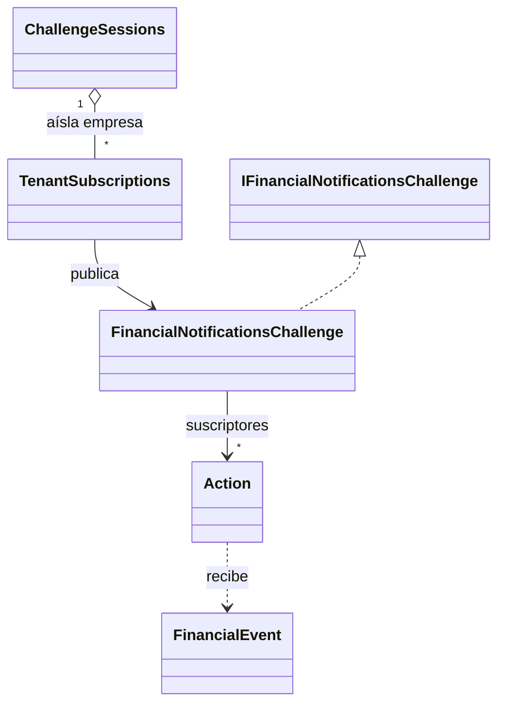
```mermaid
classDiagram
    ChallengeSessions "1" o-- "*" TenantSubscriptions : aísla empresa
    TenantSubscriptions --> FinancialNotificationsChallenge : publica
    IFinancialNotificationsChallenge <|.. FinancialNotificationsChallenge
    FinancialNotificationsChallenge --> "*" Action : suscriptores
    Action ..> FinancialEvent : recibe
```

## DP-19 State

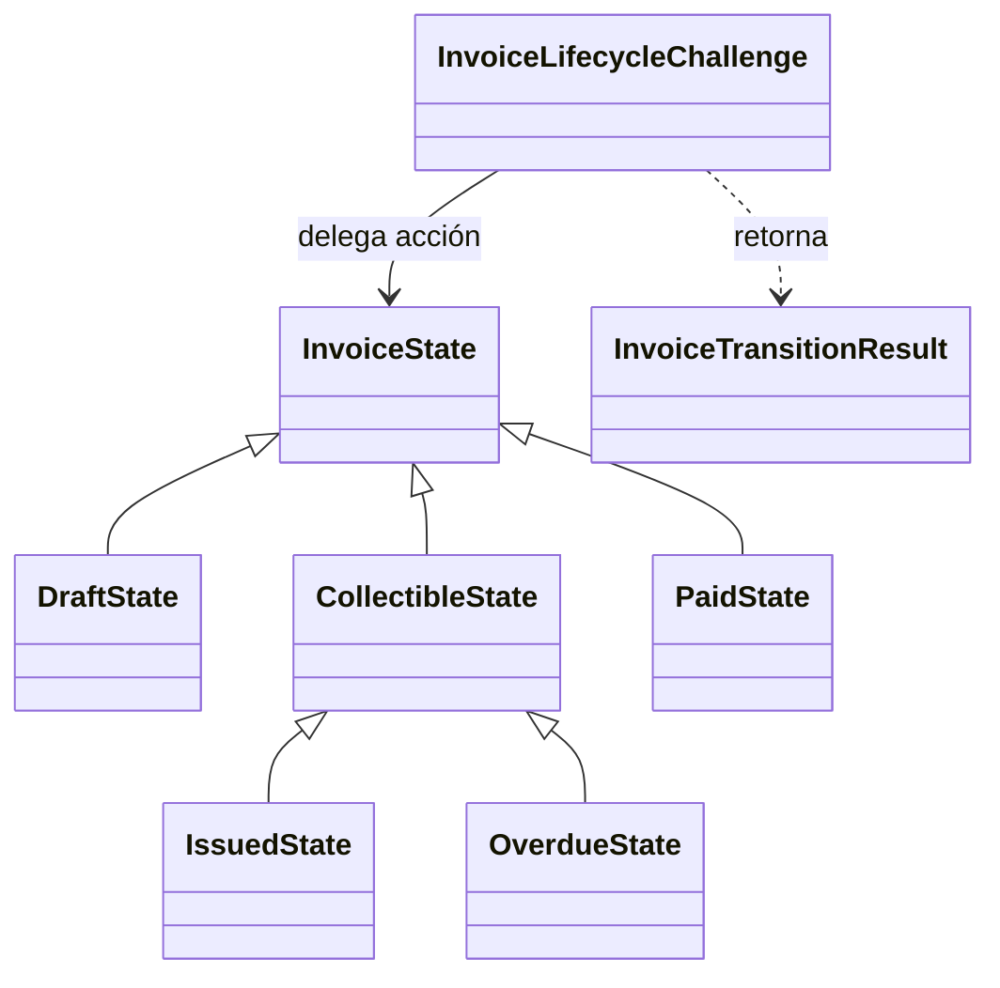
```mermaid
classDiagram
    InvoiceLifecycleChallenge --> InvoiceState : delega acción
    InvoiceState <|-- DraftState
    InvoiceState <|-- CollectibleState
    InvoiceState <|-- PaidState
    CollectibleState <|-- IssuedState
    CollectibleState <|-- OverdueState
    InvoiceLifecycleChallenge ..> InvoiceTransitionResult : retorna
```

## DP-20 Strategy

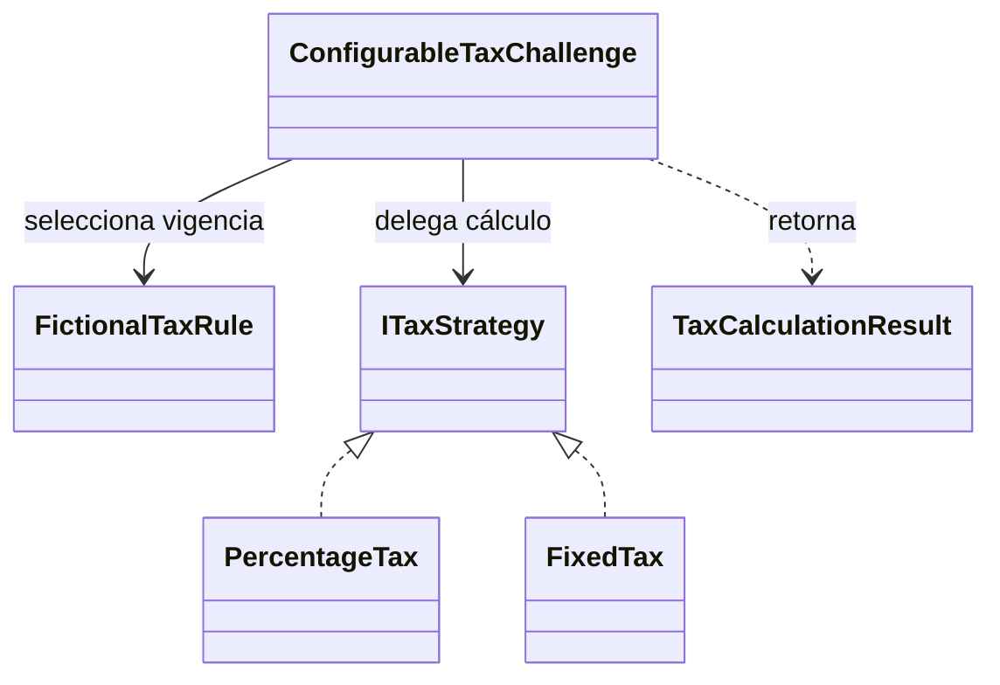
```mermaid
classDiagram
    ConfigurableTaxChallenge --> FictionalTaxRule : selecciona vigencia
    ConfigurableTaxChallenge --> ITaxStrategy : delega cálculo
    ITaxStrategy <|.. PercentageTax
    ITaxStrategy <|.. FixedTax
    ConfigurableTaxChallenge ..> TaxCalculationResult : retorna
```

## DP-21 Template Method

```mermaid
classDiagram
    BankReconciliationChallenge ..> ReconciliationProcedure : selecciona
    ReconciliationProcedure : +Run()
    ReconciliationProcedure : #AllowsDifference()
    ReconciliationProcedure <|-- ExactReconciliation
    ReconciliationProcedure <|-- ToleranceReconciliation
    ReconciliationProcedure ..> BankReconciliationResult : retorna
```

## DP-22 Visitor

```mermaid
classDiagram
    DocumentAnalysisChallenge ..> IVisitableDocument : adapta
    IVisitableDocument <|.. InvoiceElement
    IVisitableDocument <|.. PaymentElement
    IVisitableDocument <|.. JournalElement
    IVisitableDocument ..> AnalysisVisitor : acepta
    AnalysisVisitor <|-- GrossVisitor
    AnalysisVisitor <|-- CountVisitor
```

